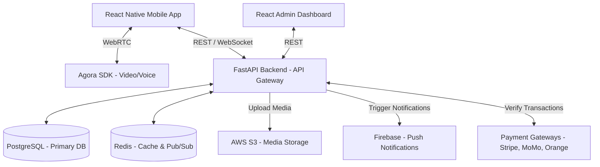

# Talkto System Architecture

## Overview
Talkto is a scalable cross-platform application designed to connect users seeking counseling with professional therapists. The architecture is designed to support high concurrency, fast real-time communications, and scalable services using a Microservices-ready structure, though starting as a modular monolith in FastAPI for easier initial deployment.

## High-Level Architecture Diagram

## Component Details

### 1. Mobile Client (React Native / Expo)
- **Framework**: React Native with Expo.
- **Language**: TypeScript for type safety and maintainability.
- **State Management**: Redux Toolkit or Zustand, combined with React Query for API data fetching.
- **Navigation**: React Navigation.

### 2. Admin Dashboard (React)
- **Framework**: React (Vite).
- **Language**: TypeScript.
- **UI Component Library**: Tailwind CSS with shadcn/ui.
- **Purpose**: Manage users, verifications, platform settings, and view analytics.

### 3. Backend Service (FastAPI / Python)
- **Framework**: FastAPI (high performance, async native, auto-generated OpenAPI docs).
- **ORM**: SQLAlchemy 2.0 with Alembic for migrations.
- **Auth**: JWT-based authentication with support for OAuth2 flows.
- **WebSockets**: Built-in FastAPI WebSockets (or Socket.IO wrapper) combined with Redis Pub/Sub to scale chat features across multiple workers.

### 4. Data Storage
- **Primary DB**: PostgreSQL. Handles all relational data (users, profiles, sessions, payments).
- **Cache / Messaging**: Redis. Handles ephemeral data (OTP codes, caching counselor directories, chat message brokering, rate limiting).
- **Object Storage**: AWS S3 (or equivalent like MinIO for local dev) for profile pictures, journal attachments, and certification documents.

### 5. External Integrations
- **Video & Voice Calls**: Agora SDK. Offers low-latency WebRTC infrastructure for the counseling sessions.
- **Push Notifications**: Firebase Cloud Messaging (FCM). For appointment reminders and chat notifications.
- **Payments**: Integration with Stripe for international cards, and APIs for MTN Mobile Money / Orange Money for African markets.
- **AI Companion**: OpenAI API (or Anthropic/open-source alternative) configured with strict prompt boundaries to offer support and escalate crises without acting as a licensed therapist.

## Scalability Strategy
1. **Horizontal Scaling**: The FastAPI backend should be stateless. Session state is managed via JWTs, and real-time state via Redis. This allows deploying multiple backend instances behind a Load Balancer.
2. **Database Optimization**: Use connection pooling (PgBouncer), indexes on heavily queried columns (e.g., `specialties`, `status`), and read replicas as read volume increases.
3. **Background Tasks**: Celery with Redis for offloading heavy tasks (e.g., sending emails, generating analytics reports, processing video recordings).
