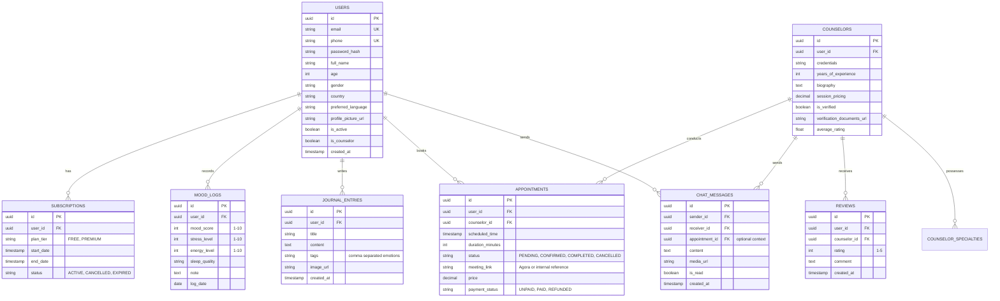

# Talkto Database Schema

This document outlines the core PostgreSQL database schema for the Talkto platform.

## ER Diagram

## Description of Core Entities

- **Users**: Central entity for all registered individuals. Holds base profile info and authentication details.
- **Counselors**: An extension of the User profile specifically for therapists/psychologists, storing their professional details, pricing, and verification status.
- **Appointments**: Represents a booked session. Ties the User and the Counselor, tracking scheduling time, status, and payment status.
- **Subscriptions**: Tracks user tiers to gate premium features like the unlimited resource library and AI assistant.
- **Chat Messages**: Stores history of messaging. Media URLs map to S3 objects.
- **Mood Logs & Journal Entries**: User-generated self-help data tracked over time for the user's personal wellness dashboard.
